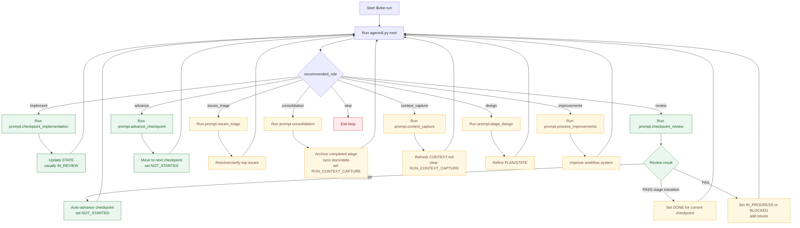

# Vibe Coding-Agent Orchestration

A practical system for running coding agents with predictable loops, explicit state, and low overhead.
This repository is the canonical reference implementation of the workflow.

## Why this exists

Agent work gets messy without a shared contract. This system makes the workflow explicit:
- **State lives in files** so any agent can pick up where the last one left off.
- **Next actions are deterministic** (chosen by tooling, not improv).
- **Small checkpoints** keep scope bounded and reviewable.
- **Context snapshots** reduce repeated rediscovery between sessions.

## The mental model

Everything runs off four files in `.vibe/`:

- `.vibe/STATE.md` -- the current truth (stage, checkpoint, status, issues).
- `.vibe/PLAN.md` -- a backlog of checkpoints with objective/deliverables/acceptance.
- `.vibe/HISTORY.md` -- non-authoritative rollups and archived logs.
- `.vibe/CONTEXT.md` -- short-lived context snapshot (decisions, gotchas, hot files, notes).

Agents do **not** invent workflows. They run the prompt loop recommended by `agentctl.py`.

## How work progresses

1) `agentctl.py next` chooses the next loop (implement, review, triage, consolidation, etc.).
2) The loop prompt is fetched from `prompts/template_prompts.md` and executed.
3) The agent updates `.vibe/STATE.md` with evidence and status changes.
4) Record the emitted `LOOP_RESULT: {...}` line:
   `python3 tools/agentctl.py --repo-root . --format json loop-result --line 'LOOP_RESULT: {...}'`
5) Repeat until the plan is exhausted or blocked.

Stages are expected to be consolidated before moving to the next stage.

## Repository layout (authoritative)

```
<repo>/
  AGENTS.md               # repo-specific execution contract (can drift)
  .vibe/
    STATE.md              # current stage/checkpoint/status/issues
    PLAN.md               # checkpoint backlog
    HISTORY.md            # rollups and archived work
    CONTEXT.md            # snapshot of key context
  prompts/                # prompt catalog + bootstrap prompts
  tools/                  # deterministic workflow tools
  templates/              # repo bootstrap + checkpoint/gate templates
  .codex/
    skills/               # Codex skill packages (SKILL.md)
```

`.vibe/` is ignored by default to avoid constant churn. If your repo benefits from versioning
workflow state, remove the ignore entry locally.

## Core tooling

### `tools/agentctl.py`

The control plane for the workflow. Key commands:

- `status` -- current stage/checkpoint + issue summary (use `--with-context` for full context).
- `next` -- deterministic recommendation for the next loop prompt.
- `validate` -- invariants for STATE/PLAN/HISTORY consistency.
- `add-checkpoint` -- insert a checkpoint from a template into PLAN.md.

### `tools/prompt_catalog.py`

Lists and retrieves prompts from `prompts/template_prompts.md` by stable ID.

### `tools/checkpoint_templates.py`

Lists, previews, and instantiates checkpoint templates from `templates/checkpoints/`.

## Workflow loops (what they do)

Loops are defined in `prompts/template_prompts.md` and chosen by `agentctl.py`:

| Loop role | Prompt ID | Intended job |
| --- | --- | --- |
| `design` | `prompt.stage_design` | Tighten or repair near-term checkpoints in `.vibe/PLAN.md` so execution is unambiguous. |
| `implement` | `prompt.checkpoint_implementation` | Implement exactly one active checkpoint, run demo commands, commit, and set status to `IN_REVIEW`. |
| `review` | `prompt.checkpoint_review` | Verify deliverables/acceptance and auto-advance to next same-stage checkpoint on PASS. |
| `issues_triage` | `prompt.issues_triage` | Resolve or clarify blocking/non-blocking issues with minimal scope changes. |
| `advance` | `prompt.advance_checkpoint` | Move `.vibe/STATE.md` from a `DONE` checkpoint to the next checkpoint and reset status to `NOT_STARTED`. |
| `consolidation` | `prompt.consolidation` | Archive completed stages and realign `.vibe/STATE.md` / `.vibe/PLAN.md` before crossing stage boundaries. |
| `context_capture` | `prompt.context_capture` | Refresh `.vibe/CONTEXT.md` and clear context-capture workflow flags after transitions/maintenance. |
| `improvements` | `prompt.process_improvements` | Improve the orchestration system itself (prompts, tooling, validation, docs). |
| `stop` | `stop` | End the loop when the backlog is exhausted. |

With a defined backlog in `.vibe/PLAN.md` and no active issues, the common cadence is:
`implement -> review (auto-advance)` (repeat), with `consolidation -> context_capture`
inserted at stage transitions.

### Active issue schema

Use one strict issue format in `.vibe/STATE.md`:

```
- [ ] ISSUE-123: Short title
  - Impact: QUESTION|MINOR|MAJOR|BLOCKER
  - Status: OPEN|IN_PROGRESS|BLOCKED|RESOLVED
  - Owner: agent|human
  - Unblock Condition: ...
  - Evidence Needed: ...
  - Notes: ...
```

`agentctl validate --strict` treats missing required fields as validation errors.

## Context snapshots

Stage 10 introduced `.vibe/CONTEXT.md` to capture only the critical context:

- Architecture (high-level system shape)
- Key decisions (dated)
- Gotchas (pitfalls and traps)
- Hot files (high-traffic files/paths)
- Agent notes (session-scoped)

Use `prompt.context_capture` to update it at session end or after stage boundaries.
Bootstrap prompts now read CONTEXT.md after STATE.md to reduce rediscovery.

## Quality gates

Stage 9 added deterministic quality gates to `agentctl.py`:

- Configure gates in `.vibe/config.json`.
- Run gates with `agentctl.py next --run-gates`.
- Templates for gates live in `templates/gates/`.

This keeps objective checks close to the workflow instead of ad-hoc "please run tests".

## Checkpoint templates

Stage 11 added checkpoint templates to reduce planning boilerplate:

- Templates live in `templates/checkpoints/`.
- Use `tools/checkpoint_templates.py list|preview|instantiate`.
- Use `agentctl add-checkpoint --template <name> --params ...` to insert into PLAN.md.

Templates cover common patterns (feature, bug, refactor, endpoint, coverage) and
include sensible default acceptance criteria.

## Bootstrapping and skills

### Bootstrap a repo

```
python3 tools/bootstrap.py init-repo /path/to/your/repo
```

This creates `.vibe/`, adds `.vibe/` to `.gitignore`, installs a baseline `AGENTS.md`,
and installs repo-local skills into `.codex/skills` from the default `vibe-base` set
(`vibe-run`, `continuous-refactor`, `continuous-test-generation`, and
`continuous-documentation` included).

Use a different set if needed:

```bash
python3 tools/bootstrap.py init-repo /path/to/your/repo --skillset vibe-core
```

### Install global skills

```
python3 tools/bootstrap.py install-skills --global --agent <agent_name>
```

Supported agents: `codex`, `claude`, `gemini`, `copilot`.

Codex is the reference implementation for continuous mode. Other agents rely on
manual bootstraps found in `prompts/init/`.

## Single-loop vs continuous

- **Single loop**: run one loop and stop (use `$vibe-one-loop` or manual prompts).
- **Continuous**: loop until `agentctl` returns `recommended_role == "stop"` (use
  `$vibe-run`, `$continuous-refactor`, `$continuous-test-generation`, or
  `$continuous-documentation`).

Codex's `$vibe-run` skill implements continuous mode. It must keep looping until
the dispatcher says stop--never just one cycle.
For non-interactive dry-runs (no executor), use
`--simulate-loop-result` to auto-acknowledge loop protocol and continue.

### Run a named workflow with a skill

To invoke `workflows/continuous-refactor.yaml`, pass the workflow name
`continuous-refactor` (without `.yaml`) to `agentctl next`.

Using repo-local skills:

```bash
python3 .codex/skills/vibe-loop/scripts/agentctl.py --repo-root . --format json next --workflow continuous-refactor
```

Using a globally installed `vibe-loop` skill:

```bash
python3 scripts/agentctl.py --repo-root /path/to/repo --format json next --workflow continuous-refactor
```

Then run the returned `recommended_prompt_id` and record `LOOP_RESULT` as usual.

`continuous-refactor` is intended for bounded continuous runs: it exits once the
latest refactor findings contain only `[MINOR]` ideas (no `[MAJOR]`/`[MODERATE]`).
Use `refactor-cycle` if you want to continue through minor-only refinements.

`continuous-test-generation` is the parallel test workflow: it runs
`prompt.test_gap_analysis`, `prompt.test_generation`, and `prompt.test_review`,
and exits once gap analysis reports only `[MINOR]` additions (no `[MAJOR]`/`[MODERATE]`).

`continuous-documentation` runs the documentation loop:
`prompt.docs_gap_analysis`, `prompt.docs_gap_fix`,
`prompt.docs_refactor_analysis`, and `prompt.docs_refactor_fix`,
and exits once unresolved documentation findings contain no `MAJOR`/`MODERATE`.

### `$vibe-run` decision flow (happy path + alternate paths)



Happy path is `implement -> review (PASS same stage auto-advance)` repeating with no
extra advance loop. Stage transitions route through `consolidation`, then
`context_capture`, then back to `implement`.
Other branches are selected when state/issue/planning conditions require them.

## How to start a session

1) Open the target repo.
2) Use the appropriate bootstrap prompt in `prompts/init/`.
3) Run the loop recommended by `agentctl.py`.
4) Update `.vibe/STATE.md` and repeat until done.

## License

See `LICENSE`.

## Documentation

- `docs/index.md` - navigation index for core docs.
- `docs/continuous_documentation_overview.md` - documentation loop scope and schema.
- `docs/documentation_severity_rubric.md` - severity classification guidance.
